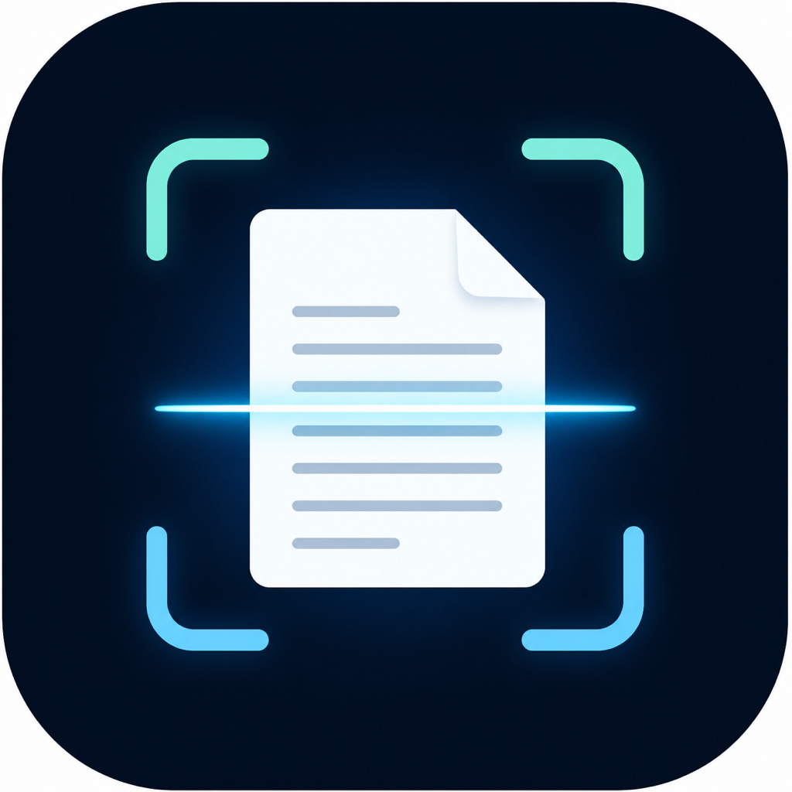

<p align="center">
  
</p>

<h1 align="center">HollyOCR</h1>

<p align="center">
  Converta PDFs, imagens, DOCX e Markdown em texto pesquisável ou Markdown organizado — com processamento local.
</p>

<p align="center">
  
  
  
  
</p>

<p align="center">
  
</p>

## O que o HollyOCR faz

- Extrai primeiro o texto selecionável e preserva o conteúdo original.
- Detecta páginas escaneadas, imagens relevantes e camadas de texto incompletas.
- Aplica OCR com Apple Vision no macOS ou Tesseract como alternativa multiplataforma.
- Combina texto nativo e OCR sem apagar a camada original e reduz duplicações.
- Gera Markdown separado por página, TXT e, opcionalmente, uma auditoria JSONL.
- Processa documentos extensos em lotes, usa disco quando necessário e retoma OCR interrompido.
- Nunca sobrescreve uma conversão anterior e grava a saída de forma atômica.

Todo o processamento acontece no computador. O HollyOCR não envia documentos para serviços externos.

## Formatos

| Entrada | Processamento |
|---|---|
| PDF | texto nativo, inspeção de imagens e OCR seletivo |
| PNG, JPG e JPEG | OCR direto sem excluir o arquivo original |
| DOCX | parágrafos, tabelas, cabeçalhos e rodapés |
| Markdown | organização e conversão para MD ou TXT |

## macOS Apple Silicon

O aplicativo é otimizado para Apple Silicon, incluindo o MacBook com chip M5. Para executar pelo código-fonte:

```bash
brew install python@3.12 poppler tesseract tesseract-lang
python3.12 -m venv .venv
source .venv/bin/activate
python -m pip install -r requirements-macos-lock.txt
python -m pip install -e . --no-deps
python -m hollyocr --gui
```

No macOS, o modo automático prioriza Apple Vision. O Poppler continua necessário para renderizar páginas de PDFs escaneados.

## Linha de comando

```bash
python -m hollyocr -i /caminho/documento.pdf -o /caminho/saida
```

Exemplos:

```bash
# Auditoria técnica por página
python -m hollyocr -i documento.pdf -o saida --page-audit

# OCR em todas as páginas, preservando o texto nativo
python -m hollyocr -i documento.pdf -o saida --force-ocr

# Tesseract explicitamente
python -m hollyocr -i documento.pdf -o saida --ocr-backend tesseract --lang por

# Apenas texto selecionável
python -m hollyocr -i documento.pdf -o saida --no-ocr
```

Use `python -m hollyocr --help` para ver todas as opções. O DPI aceito fica entre 300 e 450; o número de processos fica entre 1 e 32.

## Windows e Linux

O código possui rotas para Windows e Linux e usa Tesseract nesses sistemas. A integração contínua testa o núcleo no macOS, Windows e Linux. O instalador executável do Windows deve ser compilado e validado em um computador Windows; use `build_exe.bat` depois de instalar Python 3.12, Tesseract e Poppler.

## Compilar o aplicativo macOS

```bash
source .venv/bin/activate
./build_mac.sh
```

O script executa verificações estáticas e testes antes de gerar `dist/HollyOCR.app`. Consulte [BUILDING.md](BUILDING.md) para os detalhes e limitações de distribuição.

## Qualidade e segurança

```bash
python -m pyflakes hollyocr tests
python -m ruff check hollyocr tests
python -m pytest tests -q
python -m bandit -q -ll -r hollyocr
python -m pip_audit -r requirements-macos-lock.txt
```

O relatório da revisão que originou a versão 5.0.0 está em [AUDIT_REPORT.md](AUDIT_REPORT.md), e as mudanças estão no [CHANGELOG.md](CHANGELOG.md). Para comunicar uma vulnerabilidade, consulte [SECURITY.md](SECURITY.md).

## Versão

Versão atual: **5.0.0**, build **1**. A mudança de identidade, nome interno, dependências e regras de segurança justificou a nova versão principal.

## Licença

Distribuído sob a [Licença Apache 2.0](LICENSE).
