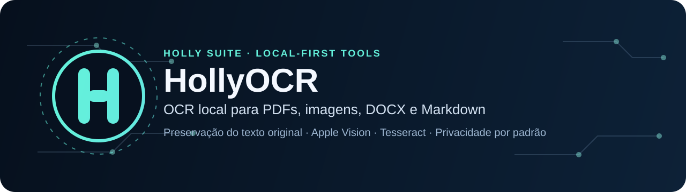
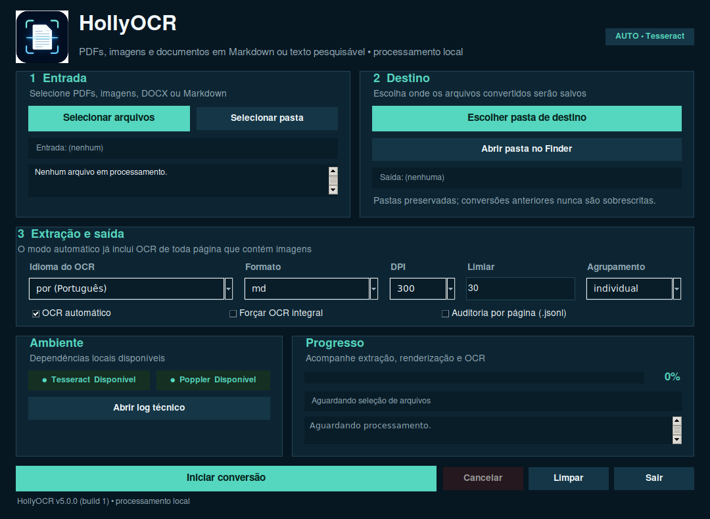

<p align="center">
  
</p>

<p align="center">
  <strong>OCR local para PDFs, imagens, DOCX e Markdown.</strong><br>
  Preservação do texto original · Privacidade por padrão · Processamento no dispositivo
</p>

<p align="center">
  
  
  
  
</p>

> **Parte da suíte Holly**  
> Ferramentas local-first para texto, documentos e mídia, com privacidade por padrão e segurança verificável.  
> [HollyTranscrição](https://github.com/HollyGM/HollyTranscricao) · [HollyCorretor](https://github.com/HollyGM/HollyCorretor) · [HollyOptimizer](https://github.com/HollyGM/HollyOptimizer)

<p align="center">
  
</p>

## O que o HollyOCR faz

- Extrai primeiro o texto selecionável e preserva o conteúdo original.
- Detecta páginas escaneadas, imagens relevantes e camadas de texto incompletas.
- Aplica OCR com Apple Vision no macOS ou Tesseract como alternativa multiplataforma.
- Combina texto nativo e OCR sem apagar a camada original. Uma linha do OCR só é descartada como duplicada quando corresponde ao texto nativo; valores, datas, nomes e negações que diferem são preservados.
- Gera Markdown separado por página, TXT e, opcionalmente, uma auditoria JSONL.
- Processa documentos extensos em lotes, usa disco quando necessário e retoma OCR interrompido ou com falha a partir das páginas já concluídas.
- Não apresenta como completa uma conversão parcial: páginas faltando na extração, renderização incompleta ou falhas de OCR são informadas como falha, sem gravar o arquivo de saída.
- Converte PDFs com fontes malformadas, que geram caracteres UTF-16 inválidos, sem abortar o documento inteiro.
- Nunca sobrescreve uma conversão anterior e grava a saída de forma atômica.
- Ao cancelar ou fechar a janela, aguarda o encerramento do processamento e a gravação do progresso antes de sair.

Todo o processamento acontece no computador. O HollyOCR não envia documentos para serviços externos.

## Formatos

| Entrada | Processamento |
|---|---|
| PDF | texto nativo, inspeção de imagens e OCR seletivo |
| PNG, JPG e JPEG | OCR direto sem excluir o arquivo original |
| DOCX | parágrafos e tabelas na ordem original, tabelas aninhadas, cabeçalhos e rodapés |
| Markdown | organização e conversão para MD ou TXT |

## macOS Apple Silicon

O aplicativo é otimizado para Apple Silicon, incluindo o MacBook com chip M5.

Requisitos:

- macOS 12 ou superior;
- Python 3.12.15 ou patch posterior da série 3.12, arm64 (obrigatório para compilar o aplicativo);
- Poppler e Tesseract com os idiomas desejados. A build atual foi validada com Poppler 26.09.0 e Tesseract 5.5.3.

Para executar pelo código-fonte:

```bash
brew install python@3.12 poppler tesseract tesseract-lang
python3.12 -m venv .venv
source .venv/bin/activate
python -m pip install -r requirements-macos-lock.txt
python -m pip install -e . --no-deps
python -m hollyocr --gui
```

No macOS, o modo automático prioriza Apple Vision. O Poppler continua necessário para renderizar páginas de PDFs escaneados. O `HollyOCR.app` compilado incorpora o Python; Poppler e Tesseract continuam externos e são localizados nas pastas do Homebrew ou no `PATH`.

No `HollyOCR.app` compilado, a extração de texto nativo (não-OCR) usa apenas `pypdf`: o PyMuPDF fica desativado por estabilidade dentro do binário empacotado pelo PyInstaller, o que também desativa o reconhecimento de colunas e o leiaute de Markdown que o PyMuPDF oferece. Ao rodar a partir do código-fonte, como acima, o PyMuPDF é usado normalmente. Para reativar o PyMuPDF no aplicativo empacotado, defina `HOLLYOCR_ENABLE_PYMUPDF=1` antes de abri-lo.

## Linha de comando

```bash
python -m hollyocr -i /caminho/documento.pdf -o /caminho/saida
```

Exemplos:

```bash
# Auditoria técnica por página
python -m hollyocr -i documento.pdf -o saida --page-audit

# OCR em todas as páginas, preservando o texto nativo
python -m hollyocr -i documento.pdf -o saida --force-ocr

# Tesseract explicitamente
python -m hollyocr -i documento.pdf -o saida --ocr-backend tesseract --lang por

# Apenas texto selecionável
python -m hollyocr -i documento.pdf -o saida --no-ocr
```

Use `python -m hollyocr --help` para ver todas as opções. O DPI aceito fica entre 300 e 450; o número de processos fica entre 1 e 32.

Observações:

- A verificação de dependências considera o mecanismo escolhido em `--ocr-backend`. Idiomas combinados do Tesseract, como `--lang por+eng`, são conferidos um a um.
- Com `--no-ocr`, um PDF cuja camada de texto nativa apresente falhas é registrado como falha, sem gerar saída. Ative o OCR para recuperar o conteúdo dessas páginas.
- O progresso do OCR fica em `.hollyocr_checkpoints/`, dentro da pasta de saída, e é removido quando a conversão termina. Checkpoints criados por versões anteriores à 5.0.1 são descartados, e o OCR desses arquivos recomeça.
- Ctrl+C interrompe o lote sem anunciar conclusão e encerra com código 130.

## Windows e Linux

O código possui rotas para Windows e Linux e usa Tesseract nesses sistemas. A integração contínua testa o núcleo no macOS, Windows e Linux. O instalador executável do Windows deve ser compilado e validado em um computador Windows; use `build_exe.bat` depois de instalar Python 3.12, Tesseract e Poppler.

## Compilar o aplicativo macOS

```bash
source .venv/bin/activate
./build_mac.sh
```

O script exige Python 3.12.15 ou patch posterior da série 3.12 em arm64, instala as dependências fixadas e executa verificações estáticas e testes antes de gerar `dist/HollyOCR.app`. Os artefatos de builds anteriores vão para a Lixeira quando `mavis-trash` está disponível; caso contrário, são preservados em `.build_backups/`. Consulte [BUILDING.md](BUILDING.md) para os detalhes e limitações de distribuição.

## Qualidade e segurança

O arquivo `requirements-macos-lock.txt` já inclui `pytest` e `pyflakes`. As demais ferramentas, usadas também na integração contínua, são instaladas à parte:

```bash
python -m pip install ruff bandit pip-audit
python -m pyflakes hollyocr tests
python -m ruff check hollyocr tests
python -m pytest tests -q
python -m bandit -q -ll -r hollyocr
python -m pip_audit -r requirements-macos-lock.txt
```

Os relatórios das revisões das versões 5.0.0 e 5.0.1 estão em [AUDIT_REPORT.md](AUDIT_REPORT.md), e as mudanças estão no [CHANGELOG.md](CHANGELOG.md). Para comunicar uma vulnerabilidade, consulte [SECURITY.md](SECURITY.md).

## Versão

Versão atual: **5.0.1**, build **4**. Esta atualização corrige a preservação de conteúdo, a extração de DOCX, a identificação de conversões incompletas e o cancelamento da interface, e atualiza o ambiente macOS para Python 3.12.15, Poppler 26.09.0 e Tesseract 5.5.3. O histórico completo está no [CHANGELOG.md](CHANGELOG.md).

## Licença

Distribuído sob a [Licença Apache 2.0](LICENSE).
